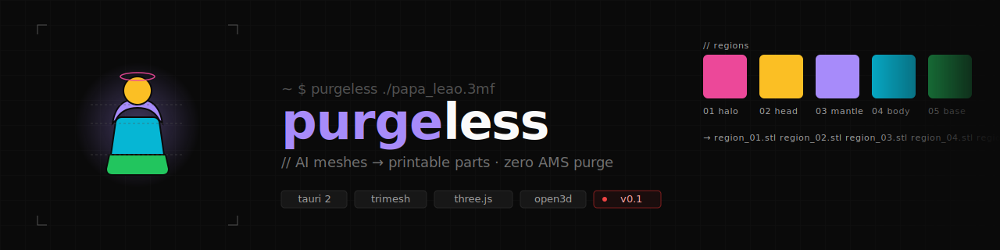

<p align="center">
  
</p>

<h1 align="center">purgeless</h1>

<p align="center">
  Desktop app that takes AI-generated 3D meshes and prepares them for multi-color printing without purge waste.
</p>

<p align="center">
  <em>Multi-part split or AMS-optimized 3MF, your choice.</em>
</p>

---

## Why

Generative AI creates meshes optimized for visuals, not for fabrication. Tools like Tripo, Meshy, Rodin, Hunyuan3D and Trellis spit out gorgeous figurines that print like garbage on a Bambu AMS — rios de filamento desperdiçados em purge.

`purgeless` is the missing step between **"AI gave me a model"** and **"I press print"**.

## What v0.1 does

- Loads `.stl`, `.3mf`, `.glb`, `.obj`, `.fbx`
- Renders mesh in a 3D viewport (orbit / zoom)
- Geometric segmentation via connected components
- Color-codes each region in the viewport
- Exports one STL per region — drop straight into Bambu Studio

Out of scope for v0.1: AI semantic segmentation, manual painting, AMS-optimize mode, procedural connectors. See the [design spec](https://github.com/gabsdevops/gdantas-control-plane/blob/main/docs/superpowers/specs/2026-05-11-purgeless-design.md) for the full roadmap.

## Quickstart

```bash
# 1. Install JS deps
pnpm install

# 2. Bootstrap the Python sidecar venv
cd sidecar && uv sync && cd ..

# 3. Run the app (first build takes ~2min for Rust)
pnpm tauri dev
```

Try it on the bundled fixture: `sidecar/fixtures/papa_leao.3mf`.

## Stack

| Layer | Tech |
|---|---|
| Shell | Tauri 2 (Rust) |
| Frontend | React 19 + TypeScript + Vite |
| 3D viewport | three.js + @react-three/fiber + @react-three/drei |
| Sidecar | Python 3.11 + trimesh + open3d + manifold3d + numpy |
| IPC | JSON-RPC over stdio |

## Tests

```bash
# Python sidecar
cd sidecar && uv run pytest -v

# TypeScript typecheck
pnpm exec tsc --noEmit

# Rust
cd src-tauri && cargo check
```

## License

TBD — likely Apache-2.0. Not OSS yet.

---

<p align="center">
  Part of the <a href="https://github.com/gabsdevops/gdantas-control-plane">gdantas control-plane</a> · made by <a href="https://gdantas.com.br">Gabriel Dantas</a>
</p>
